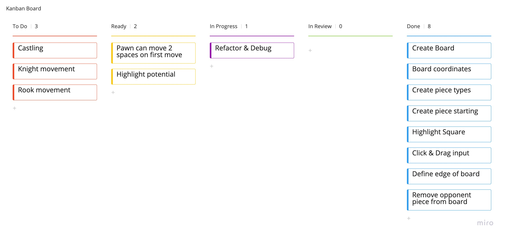

#Chess Game: Olivia Ward

##To Initialise the game run `npm run start` in the terminal

##Challenge
###Problem summary, proposed solution

The problem: I want to be able to use a “pass and play” chess game on my local machine when I am bored at home.

With a project this small with preset, regimental rules, it is difficult to define the problem. The rules of chess are constant, meaning there is a lack of space for creative development. However, the project can be developed in other ways, such as introducing a tournament concept, or playing the CPU itself. However, the simplest solution (as outlined in the brief) is a pass and play. 

###Proposed solution:

A fully functioning game of chess, which is responsive to both mouse & keyboard inputs. Due to the strict rules of chess, there are not many creative developments to be made. However the user is able to see moves they are able to make when it is their turn. I created a basic user story to display this.

##Initial Working Plan:
##Creating Epics

I started by decomposing the problem into epics, this was done by considering the different components needed. After some research into the game of chess I ended up with three. Board, Rules & turns. This helped me then decompose the problem further into tasks. From the tasks, I could then prioritise and organise as to which order tasks needed to be done. This is shown below on a Miro board, helping me visualise the problem. Tasks were sorted into slices (Something we use frequently within my team), determining a final plan.

Tickets were then able to be created and refined, including an acceptance criteria as well as tech implementation notes. These tasks can be seen on a Kanban board, the Agile method that seemed most appropriate for a project of this type.

The next step in the project was to create a flowchart. This displayed how the game could potentially play out, a sequence of events. This flowchart is an example of a basic result, in which the end result is checkmate. Creating this allowed me to display the basic end to end flow of the game.

)

##Development
###Programming Standards

Initially, I planned on using TDD throughout the duration of this project as it would ensure good quality, efficient & well-tested code. However, due to the experimental nature of this project, this became increasingly difficult. However, I did try to maintain good programming standards throughout the project. This mainly included reduced repetition, avoiding deep nesting & maintaining short, simple functions. Functions were made to be independent of each other, reducing dependencies within the code to create it more sustainable. It also made the code significantly easier to refactor. This is seen with piece movement. Separate functions are made for picking up, moving and then placing a piece down. Although it would have been possible to put them within 1 function, it would have been unnecessarily complex due to the amount of conditions required. Separating these into 3 makes the code easier to edit for future development. Creating 3 functions however, did result in some slight repetition.

Requirements:
Runs on the users local machine
Pieces can be manually removed from the board
Click and drag input

When starting this project I was ambitious, I debated using an external library for the UI of this project, such as MaterialUI. I think using a library such as this would result in a more visually appealing game, however, my main focus was not design. I focused on the functionality, I came to the conclusion that good quality visuals could still be achieved by using minimal css. If I were to develop this project further, I would focus on UX and creating a more clean cut, elegant look for the design.

I used Typescript to complete this project, the main reason is due to the decision early on to use React for the UI, the two going hand in hand. I am more familiar with this language compared to C++, therefore I could focus on the complexity of the game rather than familiarising myself with an unknown language.

##Slice 1

Development of the first slice is what I would consider ‘The basics’. I had decided to use typescript & React as I am very familiar with the two. The brief frequently mentioned finding the simplest solution to the problem, to me, this was slice 1. The necessities being a background, a board and 2 coloured sets of pieces, which can be moved on this board. I created classes for the board, tiles & each stage of piece movement. This meant the functionality of each feature was independent of each other. Using React also meant I had constant, effortless visuals of the UI at all times and could edit design features accordingly.

I felt this was a good strategy for the project, working from the ground up. It meant as the project developed and took more shape, the complexity increased accordingly. It also meant that if I reached a point where I wanted to finish the project with unfinished features (such as en passant & castling), the project was still fully functional.

After the general config was set up, I began with the board. I created arrays for both the vertical & horizontal axis. I then created a 2D array called Pieces. This represented a tile on the grid containing both an x and y coordinate. This then helped me when creating the specific pieces. I was able to assign a specific type e.g. Bishop, to a specific coordinate. I then created a basic Tile class, then using divs for the two different coloured tiles. I was then able to link these divs to a simple .css file in order to colour and organise different aspects of the UI. Using OOP when developing the UI was difficult as I was using CSS. I decided to create logical groups within the HTML. One example of this would be with the tiles. A ‘Tile’ class was made, and logical groups within this class were made, covering tiles with & without a piece on them. This helped me create organised, structured code which was very readable.

I then created the pieces. Due to the different nature of each piece type, I searched the web for chess piece pngs. I thought using these would add clarity as to the rules of the game as I was not sure at the time how complex the final solution would be. I used simple for loops that were dependent on certain coordinates to assign an image piece to a tile on the board. This involved 2 separate loops however did avoid the repetition of image names and paths. It also meant I only had to assign an image to a piece type once (twice for bishop, knight and rook). Doing this also sets each piece an initial coordinate, meaning every time the browser is refreshed or reloaded, the pieces will return to their initial position. 

##Slice 2

Slice 2 focused on the movement and boundaries of the pieces. Using an external library such as material UI could have been helpful here, however after some online research I realised that the movement I was looking to include within the solution could be done with a few simple lines of code. Using preset attributes such as ‘onMouseMove’ and ‘onMouseDown’ meant I could quickly fire an event to inform the image at the coordinate clicked to follow the cursor.
 
By this point I had a board, 32 recognisable pieces and movement of all these pieces anywhere on the browser. This technically made the game fully functional, under the assumption both users know the rules of chess. If, for example, a pawn takes a pawn, the user can simply move the stolen piece off to the side of the board, as would be done in a real life game. I had already created a lift of improvements that could be made.  One was when a piece was moved to a new tile, it could be centred to that tile. This would create a more clean cut, professional look, however made no impact to the functionality so I left it to a further improvement if I had time at the end of the project.

I decided however to take the project further, I set a board boundary meaning chess pieces could no longer be moved off the board. To this I just added a constraint to the moveThePiece function. I used a series of simple if statements to do this, although there was slight repetition, it seemed like a simple and efficient way to do so. Although this itself was not a challenge, it now meant that the solution had to recognise when a piece had taken an opponent's piece and automatically remove it from the board. This was a challenge and in my opinion the hardest part of the project.

Slice 3 was the final slice. I realised at this point that I had underestimated the workload of this project, and that the final task in this slice would be removing a piece from the board. I decided to ignore the different plays that have been used in my planning stage of the project as the plays could technically be done still, making the game playable, but the solution would not recognise these plays. 

##Slice 3 (not completed)

If I did not have the time constraints mentioned within the brief, I would have developed the solution further to recognise castling, en passant & valid moves at each user's turn. I would have also liked the solution to recognise when a player is in check, and then checkmate. At the end of the project, a player can manually remove a piece from the board and place it at the bottom of the browser.

Upon review, there are opportunities to improve my solution. The solution delivered simulates a real life chess game, under the assumption that both players are aware of the rules. The game itself does not recognise valid and invalid plays, that itself is up to the players. In the end, the functionality of the game is separated from the logic of the game itself, they do not recognise each other. Moves such as en passant & castling are technically 
possible in the solution, however the game will not detect these plays as what they are.

###Quality

As previously mentioned I did not use TDD. A large aspect of this game was UI based, so for aspects such as the playing board, the evidence of working code was visual. The board for example was unchanging, it had no dependencies. Therefore, in order to speed up the development process, I did not test these aspects. If I were to do this project again, I would do intense testing, but once again due to the experimental nature my biggest challenge was often knowing what to test. Although it is often visible that the solution is fully functional, I know there were more detailed tests I could have done.
